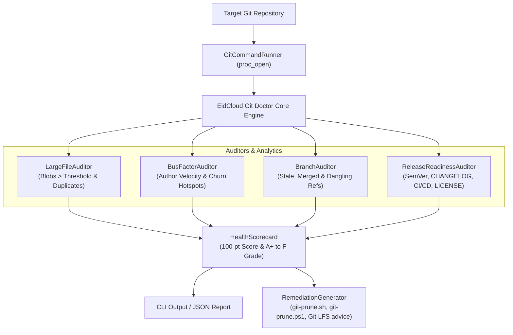

[🇸🇦 العربية](README.ar.md) | [🇬🇧 English](README.md)

# 🩺 eidcloud-git-doctor

[](https://github.com/eidcloud/eidcloud-git-doctor/releases)
[](https://www.php.net/)
[](LICENSE)
[](https://colab.research.google.com/github/eidcloud/eidcloud-git-doctor/blob/main/notebooks/quickstart.ipynb)

**eidcloud-git-doctor** is an enterprise-grade Git repository intelligence, diagnostics, and forensic health auditor written in pure PHP 8.2+ with **zero external vendor dependencies**. It audits large binary blobs, contributor bus-factor, commit velocity, branch hygiene, release readiness, and automatically generates remediation scripts for maintenance.

---

## 📌 Repository Topics

`eidcloud`, `git-doctor`, `git-analytics`, `repo-health`, `bus-factor`, `git-diagnostics`, `php8`

---

## 🏗️ Architecture & Workflow



---

## ✨ Capabilities

- **Repo Hygiene Audit**:
  - Detects oversized historical blobs exceeding thresholds (default: 50MB) via Git low-level plumbing (`cat-file --batch-check`).
  - Identifies duplicate blobs committed across multiple paths in the tree.
  - Discovers dangling commits and unreachable objects with `git fsck`.
  - Flags stale branches (inactive > 90 days) and safe-to-prune merged branches.
- **Commit Velocity & Contributor Statistics**:
  - Computes the repository **Bus-Factor** (minimum contributors holding ≥ 50% of history).
  - Pinpoints active churn hotspots (files modified most frequently).
  - Detects late-night commit patterns (23:00 to 05:00) indicating potential crunch and burnout risk.
  - Measures commit velocity (commits per week over lifetime).
- **Release Readiness Check**:
  - Validates Semantic Versioning (SemVer 2.0) on tags.
  - Confirms `CHANGELOG.md` presence and completeness.
  - Validates `LICENSE` and `README.md` presence and structure.
  - Verifies CI/CD configurations (`.github/workflows`, `.gitlab-ci.yml`, etc.).
- **Automated Remediation Script Generator**:
  - Produces runnable Bash (`git-prune.sh`) and PowerShell (`git-prune.ps1`) scripts.
  - Generates prescriptive Git LFS migration advice and `.gitattributes` tracking rules.
- **Pure PHP 8.2+ & Zero Dependencies**:
  - Runs anywhere PHP 8.2+ CLI and Git are installed. No Composer vendor overhead required.

---

## 🚀 Installation & Requirements

- **PHP**: `8.2.0` or higher
- **Git**: `2.20` or higher

```bash
git clone https://github.com/eidcloud/eidcloud-git-doctor.git
cd eidcloud-git-doctor
```

Or via Composer:
```bash
composer require eidcloud/git-doctor
```

---

## 💻 CLI Usage

```bash
# Run complete forensic health audit
php bin/eidcloud-git-doctor diagnose .

# Scan for oversized blobs (> 10MB)
php bin/eidcloud-git-doctor large-files . --threshold=10MB

# Analyze bus factor and contributor velocity
php bin/eidcloud-git-doctor bus-factor .

# Audit stale, merged, and dangling branch references
php bin/eidcloud-git-doctor branches . --stale-days=60

# Audit release readiness (SemVer, CHANGELOG, LICENSE, CI/CD)
php bin/eidcloud-git-doctor release .

# Generate automated cleanup scripts into a scripts directory
php bin/eidcloud-git-doctor remediate . --script-out=./scripts

# Output any command as clean JSON
php bin/eidcloud-git-doctor diagnose . --json
```

---

## 🧪 Testing

The repository includes a zero-dependency automated test runner:

```bash
php tests/run_tests.php
```

---

## 📓 Google Colab Quickstart

Try **eidcloud-git-doctor** directly in your browser without installing anything locally:
[](https://colab.research.google.com/github/eidcloud/eidcloud-git-doctor/blob/main/notebooks/quickstart.ipynb)

---

## 👤 Author & Maintainer

**Eng. MHD. Shadi AL-Hasan**  
- **Role:** Executive CTO & Enterprise Solutions Architect  
- **Email:** [mhd.shadi.alhasan@gmail.com](mailto:mhd.shadi.alhasan@gmail.com)  
- **Phone / WhatsApp:** [+963934005922](tel:+963934005922)  
- **Location:** Damascus, Syria  
- **GitHub:** [shadialhasan](https://github.com/shadialhasan)  

---

## 📄 License

This project is licensed under the MIT License - see the [LICENSE](LICENSE) file for details.  
Copyright (c) 2026 **MHD. Shadi AL-Hasan**. All rights reserved.
